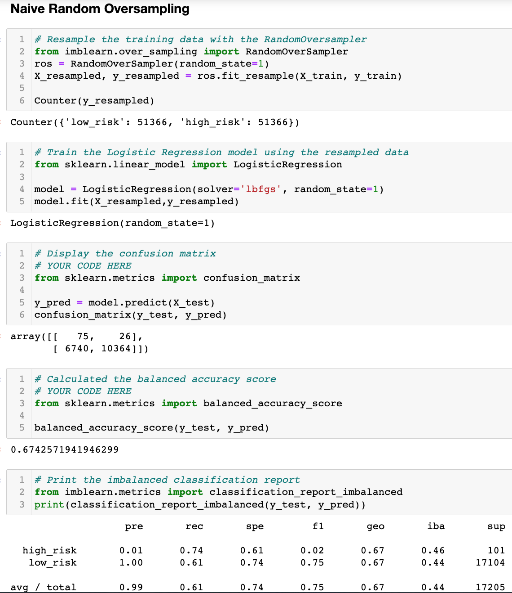
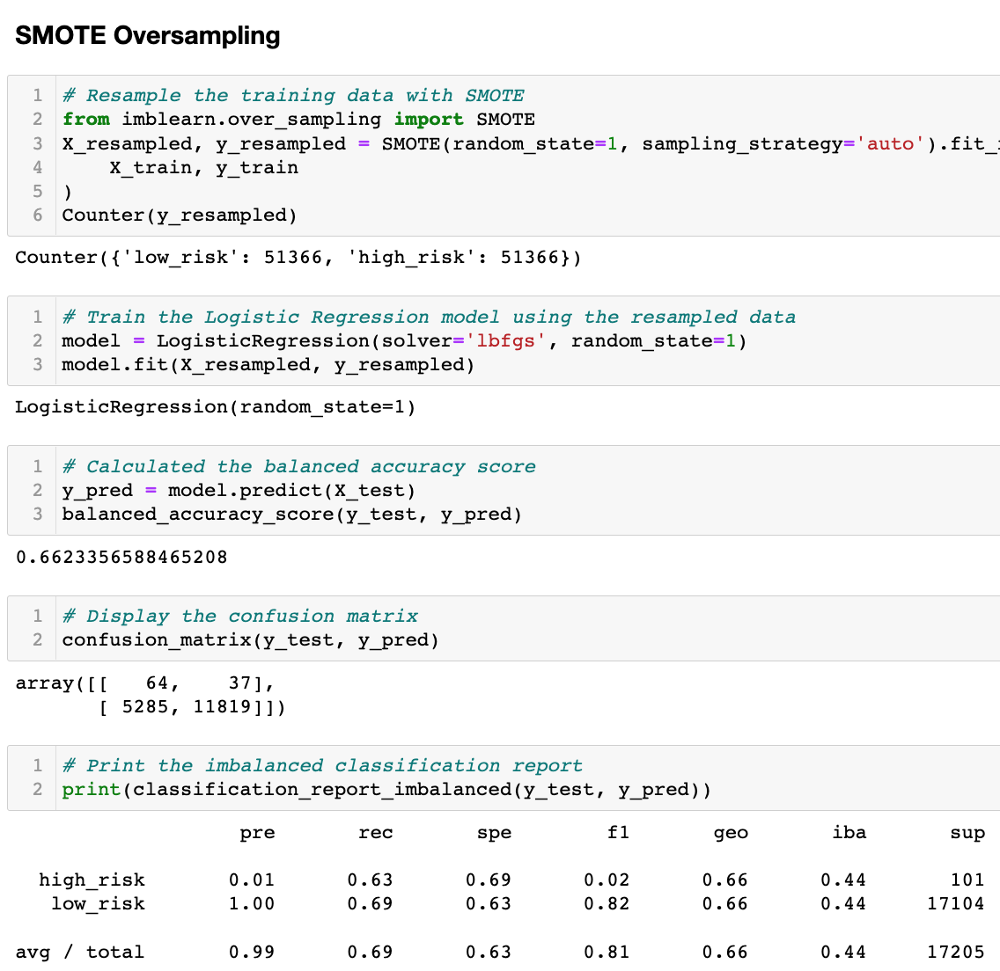
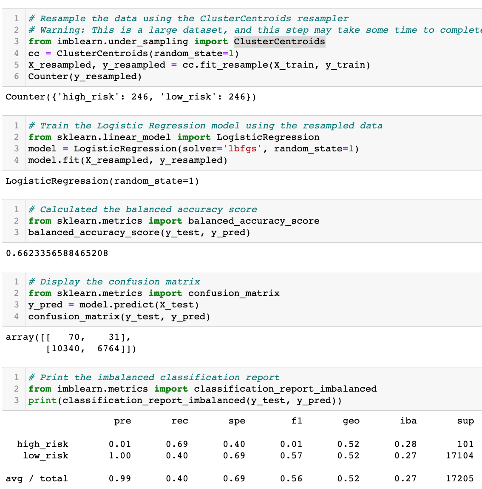
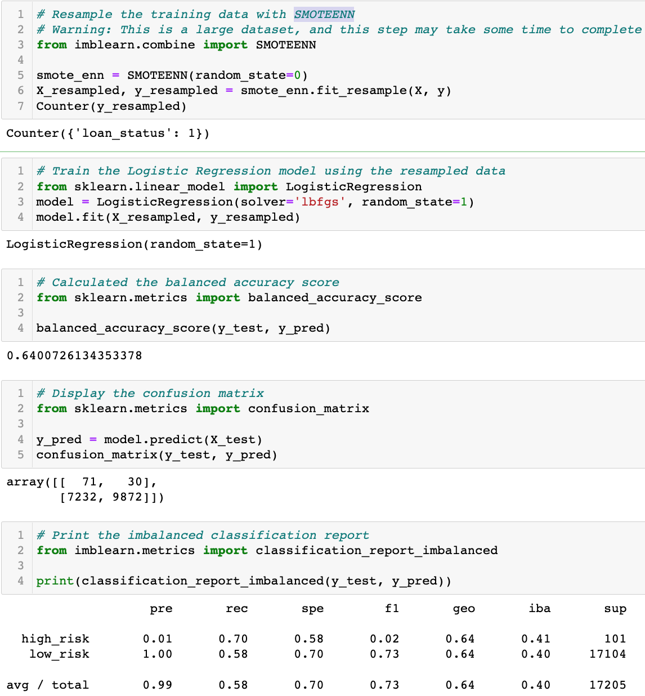
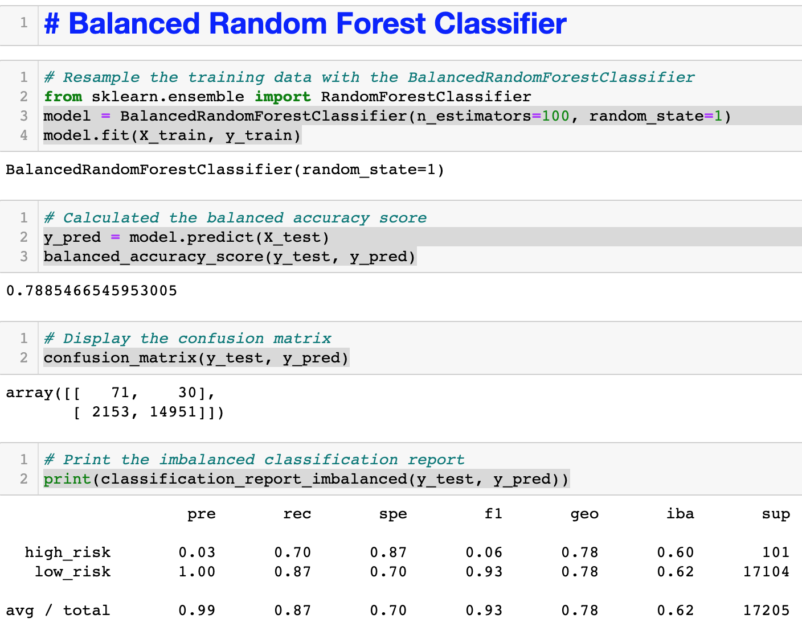
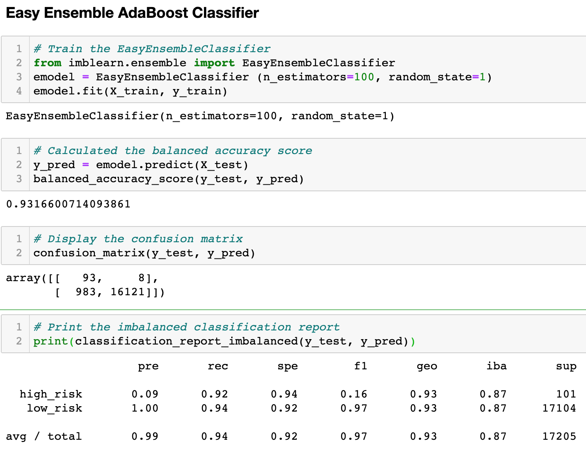

# Credit_Risk_Analysis

## Overview of the analysis
The purpose of this analysis is to determine which machine learning model is the best to use to predict credit risk.

## Results
Using bulleted lists, describe the balanced accuracy scores and the precision and recall scores of all six machine learning models. Use screenshots of your outputs to support your results.

#### Naive Random Oversampling
* Balanced accuracy score: 67%
* High-risk:
	* Precision score: 1%
	* Recall score: 74%
* Low-risk: 
	* Precision score: 100%
	* Recall score: 61%

#### SMOTE Oversampling
* Balanced accuracy score: 66%
* High-risk:
	* Precision score: 1%
	* Recall score: 63%
* Low-risk: 
	* Precision score: 100%
	* Recall score: 69%

#### Cluster Centroids Undersampling
* Balanced accuracy score: 66%
* High-risk:
	* Precision score: 1%
	* Recall score: 69%
* Low-risk: 
	* Precision score: 100%
	* Recall score: 40%

#### SMOTEENN Combination Over and Undersampling
* Balanced accuracy score: 64%
* High-risk:
	* Precision score: 1%
	* Recall score: 70%
* Low-risk: 
	* Precision score: 100%
	* Recall score: 58%

#### Balanced Random Forest Classifier
* Balanced accuracy score: 79%
* High-risk:
	* Precision score: 3%
	* Recall score: 70%
* Low-risk:
	* Precision score: 100%
	* Recall score: 87%

#### Easy Ensemble AdaBoost Classifier
* Balanced accuracy score: 93%
* High-risk:
	* Precision score: 9%
	* Recall score: 92%
* Low-risk:
	* Precision score: 100%
	* Recall score: 94% 

## Summary
The best machine learning model to use is the Easy Ensemble AdaBoost Classifier as it has a balanced accuracy score of 93% and the highest precision and recall percentages for both high and low credit risk.
